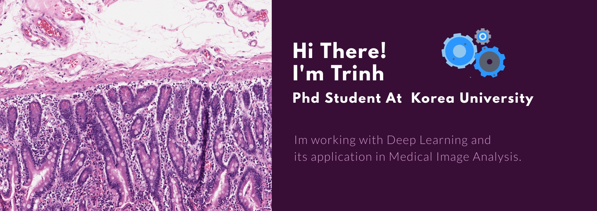

<!-- ### Hi there 👋  -->
<!--  -->
 ### Hi there 👋
I’m Trinh. I obtained my Ph.D. in Computer Engineering from Korea University in February 2026 and my Master’s degree in Computer Science from Sejong University in 2021.

👯 Feel free to reach out about research or anything else.

🔭 My [[Google scholar]](https://scholar.google.ca/citations?hl=en&user=trFdwLkAAAAJ) \
💬 Keep in touch with me on [[Twitter]](https://twitter.com/TrinhVuongKU) or [[Linkedin]](https://www.linkedin.com/in/trinh-vuong-218812193/)\
⚡My Ph.D. is funded by "Hyundai Motor Chung Mong-Koo Global Scholarship" (2021-2025).

### Challenges:

- **1st** in VQA task and **2nd** in Action Recognition and Action Anticipation tasks in [[Trauma THOMPSON]](https://thompson-challenge.grand-challenge.org/) challenge at MICCAI2023 
- **3rd** in Automated Gleason Grading Challenge [[AGGC]](https://aggc22.grand-challenge.org/final-rankings/)  at MICCAI2022 
- **19th/1327 Silver medal** in UBC Ovarian Cancer Subtype Classification and Outlier Detection [[UBC-OCEAN-2024]](https://www.kaggle.com/competitions/UBC-OCEAN/leaderboard?) 
- 16th-F1, 25th-running time in [[CellSeg]](https://neurips22-cellseg.grand-challenge.org/testing-results/) NeurIPS22 
- 11th in [[PAIP 2021]](https://paip2021.grand-challenge.org/Final-rank/) Challenge: Perineural Invasion in Multiple Organ Cancer 

<!--

 
 

 

**timmyvg/timmyvg TrinhVuongKU/VgTimmy** is a ✨ _special_ ✨ repository because its `README.md` (this file) appears on your GitHub profile.

Here are some ideas to get you started:

- 🔭 I’m currently working on ...
- 🌱 I’m currently learning ...
- 👯 I’m looking to collaborate on ...
- 🤔 I’m looking for help with ...
- 💬 Ask me about ...
- 📫 How to reach me: ...
- 😄 Pronouns: ...
- ⚡ Fun fact: ...

-->
